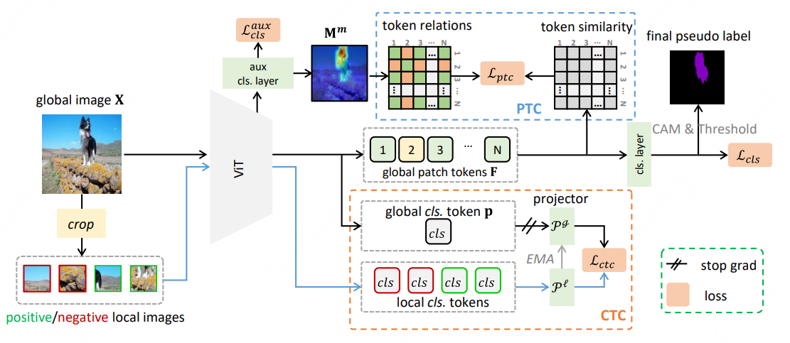

# EvoProto

This repository contains a source snapshot of the EvoProto research workspace, including the current explicit-prototype restoration and earlier experiment implementations.

## 当前方法：保留显式 prototype 的恢复版

本分支的当前研究实现是 **[experiments/restore_proto_v1](experiments/restore_proto_v1/README.md)**，保留以下主线：

- 每个类别都有可学习的 512 维 prototype，旧原型继承、新原型随训练优化。
- 从训练弱证据估计混淆关系，实际用于 KD 权重和 SEP 对手选择。
- 原型像素监督、原型预测 KD、原型预测 SEP 共同优化原型及共享特征，并保留较弱的主头辅助项。
- VOC 10-5 完整增量训练；两卡各 batch 4，总 batch 8；每个增量阶段 8,000 步。
- 同配置运行去混淆、去原型训练约束的消融；仅保留阶段最终权重及必要前驱。

当前 ALD 关闭。完整最终评估和消融仍在进行，不能把历史 71.x 成绩当成本恢复版已取得的结果。实现、损失公式、运行前提和比较口径见 [恢复版说明](experiments/restore_proto_v1/README.md)。核心逻辑见 [mechanism.py](experiments/restore_proto_v1/mechanism.py)。

下载这一版时请指定分支：

```sh
git clone --branch codex/restore-proto-4090 https://github.com/ZhonggaiWang/evoproto.git
```

## 历史方法：unified_relations_v4

[unified_relations_v4](experiments/unified_relations_v4) 保留用于历史追溯，不是本分支当前推荐的原型恢复版入口。其历史 VOC 10-5 记录为保持长宽比、面积约 672 平方时 **71.516 mIoU**，或 square448 时 **70.080**。这是从已有 ALDv9 权重进行 300 步分割头细化的结果，不是本轮独立完整增量链重跑；对应父模型为 71.454，不能把继承的性能归因于该细化。

## Repository scope and reproduction requirements

- Includes source code, experiment snapshots, tests, dataset split lists and image-level label metadata, and method/protocol records.
- Excludes image datasets, model checkpoints, training output directories, runtime environments, logs, IDE connection settings, and the manuscript PDF.
- Historical experiment snapshots are retained for traceability. Their code is not presented as the current preferred method.
- Training and inference entry points still contain the original development-machine paths and depend on artifacts under `runs/`, pretrained weights and local environment configuration. A fresh clone is a source archive, not a self-contained one-command reproduction package. Restore the required artifacts and configure paths before running experiments.
- No license is added by this import. Existing upstream acknowledgments and source notices are retained below and in individual files.

## Import provenance

Imported on 2026-10-08 from the working tree based on upstream commit `f954f43`, including local research changes. A new clean history excludes historical IDE and connection files. Per-file hashes of the copied source are recorded in `docs/source_snapshot_manifest.json` (before publication-only README and ignore-list edits).

---

## 历史记录：EvoProto ALD 对照

当前使用项目内 conda 环境 `.runtime/env`，在 VOC 10-5 上比较 ALD 关闭、旧融合、保留新拒绝区域 ignore、只在 teacher 背景区域保留 ignore 四组。KD/SEP 权重均为 0；四组共享原正式 step0，并统一忽略真实图像框外的 padding。复现与指标口径见 [ALD 实验协议](docs/ald_fusion_protocol.md)。 当前运行状态与验证记录见 [ALD 实验记录](docs/ald_fusion_results.md)。

```bash
cd /ML-vePFS/infra_rd/kun/others/wzg/workspace/evoproto
source scripts/activate_baseline_env.sh
python -B tools/run_ald_study.py --smoke --output runs/ald_smoke_reproduction
python -B tools/run_ald_study.py --output runs/ald_reproduction --gpus 0,1,2,3
```

每组独占一个 runner 管理的 GPU 任务，完成自己的 step1 后立即启动 step2。正式预算为每阶段 8,000 次迭代，全局 batch 为 8。运行器拒绝覆盖未完成阶段；输出目录应使用新名称。训练、缓存和日志均位于本项目，外部数据只读。

## 历史记录：ALD 新类 gate 后续对照

已准备单变量 `new_fallback`：legacy gate 丢掉全部正 NEW 时，额外保留最强的一个当前新类。两臂均采用 legacy 融合，自己的 legacy 控制与候选共享初始化和预算。20项CPU gate测试、训练副本合同及4/4 CUDA smoke通过，正式训练等待GPU0/1主任务各自完成后接续。方法与风险见 [NEW gate协议](docs/ald_gate_new_protocol.md)，验证范围见 [实验记录](docs/ald_gate_new_results.md)。最小独立训练副本位于同一项目的 `experiments/ald_gate_new_v1`，以保留在途主实验的冻结源码。

## 历史记录：EvoProto 固定权重基线

此前 BASE、固定原型方向 KD、前景原型 SEP 和 KD+SEP 的正式实验已完成 9/9 阶段。新增约束权重为 0.1、分离 margin 为 0，ALD 和 confusion reweight 均关闭。方法见 [基线协议](docs/fixed_baseline_protocol.md)，结果见 [基线报告](docs/fixed_baseline_results.md)。

历史结果保存在 `runs/fixed_baseline_v1/`，对应旧源码已独立保存为该目录中的 `source_snapshot.tar.gz` 和 SHA 清单 `source_snapshot.json`。当前源码已加入 ALD 与共同 padding 修正；对 ALD 的收益判断应比较本次新训练的 off 对照，不能把与历史 BASE 的差异全部归因于 ALD。

下方保留上游 TOCO 项目的原始说明。

## Token Contrast for Weakly-Supervised Semantic Segmentation

Code of CVPR 2023 paper: Token Contrast for Weakly-Supervised Semantic Segmentation.

[[arXiv]](https://arxiv.org/abs/2303.01267) [[Poster]](https://rulixiang.github.io/assets/files/CVPR2023_TOCO_poster.pdf)

<div align="center">

<br>
  
</div>

<!-- ## Abastract -->

We proposed Token Contrast to address the over-smoothing issue and further leverage the virtue of ViT for the Weakly-Supervised Semantic Segmentation task.

## Data Preparations
<details>
<summary>
VOC dataset
</summary>

#### 1. Download

``` bash
wget http://host.robots.ox.ac.uk/pascal/VOC/voc2012/VOCtrainval_11-May-2012.tar
tar –xvf VOCtrainval_11-May-2012.tar
```
#### 2. Download the augmented annotations
The augmented annotations are from [SBD dataset](http://home.bharathh.info/pubs/codes/SBD/download.html). Here is a download link of the augmented annotations at
[DropBox](https://www.dropbox.com/s/oeu149j8qtbs1x0/SegmentationClassAug.zip?dl=0). After downloading ` SegmentationClassAug.zip `, you should unzip it and move it to `VOCdevkit/VOC2012`. The directory sctructure should thus be 

``` bash
VOCdevkit/
└── VOC2012
    ├── Annotations
    ├── ImageSets
    ├── JPEGImages
    ├── SegmentationClass
    ├── SegmentationClassAug
    └── SegmentationObject
```
</details>

<details>

<summary>
COCO dataset
</summary>

#### 1. Download
``` bash
wget http://images.cocodataset.org/zips/train2014.zip
wget http://images.cocodataset.org/zips/val2014.zip
```
#### 2. Generating VOC style segmentation labels for COCO
To generate VOC style segmentation labels for COCO dataset, you could use the scripts provided at this [repo](https://github.com/alicranck/coco2voc). Or, just download the generated masks from [Google Drive](https://drive.google.com/file/d/147kbmwiXUnd2dW9_j8L5L0qwFYHUcP9I/view?usp=share_link).

I recommend to organize the images and labels in `coco2014` and `SegmentationClass`, respectively.

``` bash
MSCOCO/
├── coco2014
│    ├── train2014
│    └── val2014
└── SegmentationClass
     ├── train2014
     └── val2014
```


</details>

## Create environment
I used docker to build the enviroment.
``` bash 
## build docker
docker bulid -t toco --network=host -< Dockerfile

## activate docker
docker run -it --gpus all --network=host --ipc=host -v $CODE_PATH:/workspace/TOCO -v /$VOC_PATH:/workspace/VOCdevkit -v $COCO_ANNO_PATH:/workspace/MSCOCO -v $COCO_IMG_PATH:/workspace/coco2014 toco:latest /bin/bash
```

### Clone this repo

```bash
git clone https://github.com/rulixiang/toco.git
cd toco
```

### Build Reg Loss

To use the regularized loss, download and compile the python extension, see [Here](https://github.com/meng-tang/rloss/tree/master/pytorch#build-python-extension-module).
### Train
To start training, just run:
```bash
## for VOC
CUDA_VISIBLE_DEVICES=0,1 python -m torch.distributed.launch --nproc_per_node=2 --master_port=29501 scripts/dist_train_voc_seg_neg.py --work_dir work_dir_voc
## for COCO
CUDA_VISIBLE_DEVICES=0,1,2,3 python -m torch.distributed.launch --nproc_per_node=4 --master_port=29501 scripts/dist_train_coco_seg_neg.py --work_dir work_dir_coco
```
### Evalution
To evaluation:
```bash
## for VOC
python tools/infer_seg_voc.py --model_path $model_path --backbone vit_base_patch16_224 --infer val
## for COCO
CUDA_VISIBLE_DEVICES=0,1,2,3 python -m torch.distributed.launch --nproc_per_node=4 --master_port=29501 tools/infer_seg_voc.py --model_path $model_path --backbone vit_base_patch16_224 --infer val
```
<!-- You should get the training logs by running the above commands. Also, check our training log under `logs/`. -->

## Results
Here we report the performance on VOC and COCO dataset. `MS+CRF` denotes multi-scale test and CRF processing.

|Dataset|Backbone|*val*|Log|Weights|*val* (with MS+CRF)|*test* (with MS+CRF)|
|:---:|:---:|:---:|:---:|:---:|:---:|:---:|
|VOC|DeiT-B|68.1|[log](./logs/toco_deit-b_voc_20k.log)|[weights](https://drive.google.com/drive/folders/18Ya0w-CwSFKgzS7gTecpqMn0qgfdf1tu?usp=share_link)|69.8|70.5|
|VOC|ViT-B|69.2|[log](./logs/toco_vit-b_voc_20k.log)|[weights](https://drive.google.com/drive/folders/18Ya0w-CwSFKgzS7gTecpqMn0qgfdf1tu?usp=share_link)|71.1|72.2|
|COCO|DeiT-B|--|[log](./logs/toco_deit-b_coco_80k.log)|[weights](https://drive.google.com/drive/folders/18Ya0w-CwSFKgzS7gTecpqMn0qgfdf1tu?usp=share_link)|41.3|--|
|COCO|ViT-B|--|[log](./logs/toco_vit-b_coco_80k.log)|[weights](https://drive.google.com/drive/folders/18Ya0w-CwSFKgzS7gTecpqMn0qgfdf1tu?usp=share_link)|42.2|--|


## Citation
Please kindly cite our paper if you find it's helpful in your work.

``` bibtex
@inproceedings{ru2023token,
    title = {Token Contrast for Weakly-Supervised Semantic Segmentation},
    author = {Lixiang Ru and Heliang Zheng and Yibing Zhan and Bo Du}
    booktitle = {CVPR},
    year = {2023},
  }
```

## Acknowledgement

We mainly use [ViT-B](https://github.com/huggingface/pytorch-image-models/blob/main/timm/models/vit.py) and [DeiT-B](https://github.com/huggingface/pytorch-image-models/blob/main/timm/models/deit.py) as the backbone, which are based on [timm](https://github.com/huggingface/pytorch-image-models). Also, we use the [Regularized Loss](https://github.com/meng-tang/rloss). Many thanks to their brilliant works!
