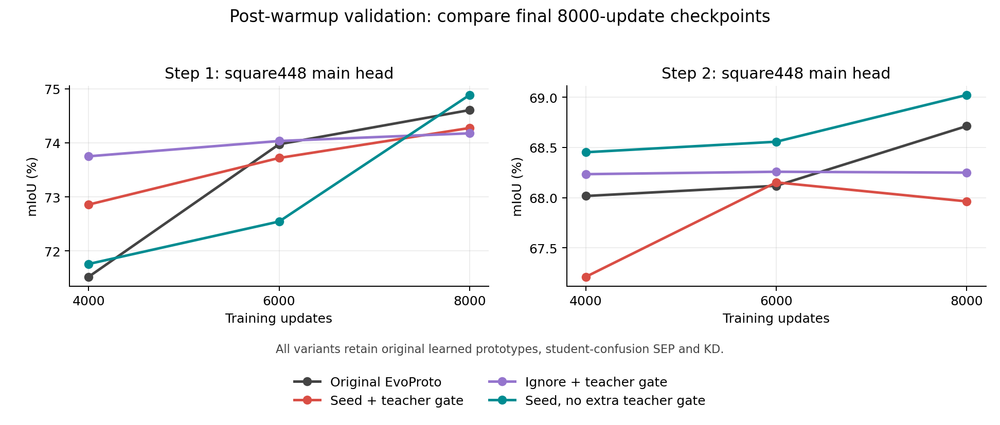

# Seed-supported teacher correction (experimental, not yet adopted)

全部三组完整实验已结束。最好的种子校正候选为 **70.4831 mIoU**，基线 **70.0644**；单次 +0.4187 的图像重采样区间跨零，需复验。新增教师关系筛选未带来收益。原有混淆建模、可学习 prototype、SEP、KD 均保留。完整结果见文末。

## Problem

A previous-stage teacher has no novel-class output. Similar novel objects can therefore be assigned to old foreground classes, rather than background. Incomplete novel CAMs leave these regions under erroneous hard old-class supervision. The goal is to identify and correct this old-class absorption of novel regions, while preserving real old objects.

## Method

The existing learnable 512-D prototypes, student-confusion graph, SEP, KD and old-prototype direction loss remain active. OLC and legacy ALD are off.

1. Select foreground anchors where current main and auxiliary CAM agree at >=.7, permitted image tags and PAR agree. Old anchors additionally require teacher agreement. Select background references where teacher/PAR agree on background and both CAM maxima are <.25.
2. On reliable novel anchors, measure a directed teacher-confusion relation: row = novel seed class; column = previous-stage teacher's prediction. EMA decay .99, synchronized across GPUs, at least 3 distinct images per edge; retain top2 supported old-foreground columns. Background contributes to row mass but is never a correction target. This is distinct from the unchanged student-confusion graph used by SEP/KD.
3. For each image, pool normalized frozen teacher encoder features at each reference class's anchors (minimum 2 feature-grid pixels). These temporary 768-D seed prototypes are not learned parameters and do not replace the original learnable prototypes.
4. A novel region can expand only through spatially connected feature-grid pixels which are at least as similar as the 10th percentile of its seed similarities, more similar to that novel prototype than other available reference prototypes, and supported by both CAMs at >=.25. At least one competing reference is required. No new trainable network or retained image/feature bank is introduced.
5. Correct only pixels currently assigned to old foreground, in these expanded regions, whose teacher old class matches the directed confusion relation. Never change reliable old anchors on the feature grid, current novel labels, background labels, padding or existing ignore pixels. Restore image-resolution pair gating after interpolation.
6. Replace their old hard labels with the supported novel class for both main/prototype segmentation BCE. Remove contradictory PTC/SEP/KD constraints on the same pixels. Original student-confusion estimation and every other loss remain unchanged. Activate after the original 2000-update warmup; update teacher-confusion evidence throughout training.

The graph uses the current synchronized batch's detached seed evidence. It never uses validation pixels or pixel GT. New image tags are the only current-stage training annotations; old tags remain teacher predictions.

## Predeclared comparisons

- baseline: existing completed full restored EvoProto, no OLC.
- correct: seed-supported correction gated by teacher confusion.
- ignore: identical evidence/gating but removes those old labels; preserve original BCE denominator to avoid rescaling other pixels.
- no_graph: identical prototype/seed/spatial evidence and hard novel-label replacement as correct, but no teacher-confusion pair gate. This isolates the gate within hard correction, not within ignore mode.

All new arms start from the same fixed Step0, have their own Step1->Step2 chain, each stage8000 updates, seed0, crop448, global batch8=4/GPU, physical4090 GPUs5/6. No continuation, best-iteration selection or extra training. Final weights only; stage1 retained while needed as teacher.

Evaluate main and fixed .5 main/prototype fusion under square448 and aspect-preserving area672. Test-time segmentation uses neither image tags nor this correction module.

## Diagnostics

CPU and two-rank tests cover direction, unique-image support, graph synchronization, connected expansion, preservation of reliable old anchors, no-seed/no-reference cases, padding and input immutability.

Initial offline diagnosis calibrates the teacher graph on 200 deterministic training images through the image-only dataset, then measures corrections on 200 disjoint validation images. On final trained arms, the saved online training graph is used instead. Pixel masks enter metric calculation only after proposals are fixed. Record per-image results to expose concentration in a few objects.

At2000/4000/6000/8000 updates, 80 fixed validation images diagnose current seed precision and old-on-new vs new-on-old pseudo-label errors without updating the graph or training. These are prospective correction diagnostics; main segmentation validation remains tag-free. No intermediate model weights are saved.

The initial baseline audit found Step1 correction precision97.52%, with93576 novel pixels rescued from old labels and956 true-old pixels relabeled novel; ungated correction precision96.03%, with96150 rescues and1824 old-to-new errors. This is a limited offline diagnosis, not a final segmentation improvement. Step2 corrections were sparse (2353 valid pixels in200 images). These hypotheses still require the complete training comparison.

## Reproduction

`CUDA_VISIBLE_DEVICES='' GLOO_SOCKET_IFNAME=lo OMP_NUM_THREADS=1 .runtime/restore_proto/venv/bin/python -B -m torch.distributed.run --master_addr=127.0.0.1 --master_port=49376 --nproc_per_node=2 experiments/restore_proto_seed_v1/test_mechanism.py --ddp`

Start the authorized GPU5/6 reservation helper, then:

`.runtime/restore_proto/venv/bin/python -B experiments/restore_proto_seed_v1/run.py --smoke --arms baseline off correct ignore no_graph`

`.runtime/restore_proto/venv/bin/python -B experiments/restore_proto_seed_v1/run.py --arms correct ignore no_graph`

The reservation remains held between jobs and on failures until the active goal ends. Release explicitly at goal completion. Full source hashes, checkpoint lineage, commands, metrics, graph state and cleanup receipts are saved under runs/restore_proto_seed_v1.

## Limits

The teacher-confusion gate is Boolean top2, not a weight proportional to confusion strength. It requires at least 3 supporting images and a positive EMA count, but has no minimum absolute confusion-rate threshold. Background remains in the denominator for reporting; a shared row denominator does not alter top2 ranking or positivity, so it does not itself suppress rare foreground edges in background-dominated rows. Downstream pixel evidence still applies. This limitation is recorded without changing the running experiment.

One seed; adaptively inspected VOC validation. Seed quality may be worse early in training than in the initial final-checkpoint audit. Teacher features may fail to separate visually similar classes. Connected expansion and relative prototypes limit but do not eliminate mistakes. The method's novelty and final segmentation benefit are not established by this pilot.

## 中文说明：混淆关系如何指导伪标签校正

这是一个训练中的伪标签校正实验，目前尚未证明最终分割收益。原始可学习 prototype、SEP、KD 都保留。

旧教师没有新类输出，因此“旧类置信度很高”也不能排除这个像素实际上属于新类。当前方法先从主、辅助 CAM 与 PAR 一致的位置取得可靠新类种子，再问两个问题：这个新类经常被教师认成哪个旧类？图像里哪些相邻像素与这个新类种子的特征相似？两类证据同时成立，才考虑撤掉错误旧标签并改成新类。

- **类别层面的信号**：以新类种子类别为行、旧教师预测为列，在线累计有方向的混淆关系。例如“狗种子经常被教师认成猫”。这是种子估计，不是使用像素真值得到的混淆矩阵。
- **像素层面的证据**：在当前图像内，把同类种子的冻结教师编码特征平均成一个临时原型。候选像素需要与种子空间连通、具有双 CAM 支持、足够接近新类原型，并且比其他参考原型更接近它。没有可靠种子或竞争参考时，不执行校正。
- **最终动作**：只处理当前被分配给旧前景类、且命中上述有方向混淆关系的像素。将其主分支与 prototype 分支的旧类硬标签改为新类，同时撤掉该处矛盾的 PTC、SEP、KD 约束。背景、已有新类标签、忽略区和填充区不参与这种替换。

这里有两套用途不同的关系：原有学生混淆关系继续控制 SEP/KD；新增教师混淆关系控制本次伪标签校正。临时种子原型使用 768 维冻结编码特征，原有 512 维可学习原型分支仍照常训练，两者不能混称。

前 2000 次更新只积累新关系，随后在同一段 8000 次训练内启用校正，不增加继续训练阶段。推理仍使用普通分割输出，不需要图像类别标签，也不执行本校正流程。

三组新实验比较直接赋新类标签、只忽略旧标签，以及直接赋新类标签时是否使用混淆关系筛选。no_graph 仍然执行硬标签替换，所以只能检验这种替换方式下的混淆筛选作用，不能单独证明混淆筛选对 ignore 模式有益。correct 与 ignore 沿用相同选区规则，但模型和教师随训练分化，实际选中的像素不保证相同。三组均从同一个 Step0 开始，各自完整训练 Step1 和 Step2，并采用相同训练预算。

当前混淆筛选是“是否入选”的开关，不是按混淆比例加权。每个新类保留至少 3 张不同图像支持、EMA 计数大于零的最多前两个旧类关系，没有设置最小混淆比例。背景保留在分母里便于解释统计，但同一行除以相同分母不会改变排序，因此不能据此声称弱混淆关系已经被抑制。这个限制需要结合最后的对照结果理解，实验中途不修改筛选规则。

ignore 模式的诊断也要单独解释：changed_to_true_new 检查候选新类别是否符合真值，实际训练标签仍被设为忽略值，并未赋成新类。选中真实背景不等于把背景错标为新类；选中真实旧类也不一定意味着撤掉正确标签，因为原旧类标签本身可能已经错了。

必须区分三类数字：种子准确率；拟校正像素的准确率与覆盖率；最终分割 mIoU。前两项改善不保证第三项改善。训练期间的 80 图诊断是当前模型对固定验证图像的拟校正分析，不是整个训练过程的累计像素准确率。每 50 次记录的训练像素数量也只是该次采样 batch 的统计。

最终分割错误分析以 Step2 的类别划分为主：旧前景为类别 1–15，新类为 16–20，背景不计入旧前景。另保留“初始 10 类 / 后续引入 10 类”的描述性统计，避免把 Step1 引入的类在 Step2 中误称为当前新类。该分析来自无图像标签推理的混淆矩阵，分母分别是真实新类或真实旧类像素数，与伪标签校正准确率含义不同。

## 带新增教师筛选的校正组完整结果

`correct` 组已经完成 Step1 和 Step2 各 8000 次更新。原型方向更新与阶段权重来源检查通过；各训练超参数与原基线一致，仅增加本校正模块及对应输出路径。当前主实验没有带来最终分割增益，原基线仍应保留。

| 推理设置 | 原基线 mIoU | 校正组 mIoU | 差值 |
|---|---:|---:|---:|
| 方形 448，主分支 | 68.7124 | 67.9630 | -0.7494 |
| 方形 448，固定 0.5 融合 | 68.8482 | 68.0603 | -0.7879 |
| 保持长宽比 672，主分支 | 69.8904 | 69.0230 | -0.8673 |
| 保持长宽比 672，固定 0.5 融合 | 70.0644 | 69.1531 | -0.9113 |

主分支和固定融合均使用同一批 1449 张验证图像、相同 GPU 推理设置。最后一行差值的配对图像 bootstrap 95% 区间为 [-1.6082, -0.2020]；这只反映图像采样不确定性，不代表多次训练种子的方差。

固定融合下，真实当前新类像素被预测成旧类的比例由 9.6775% 降至 8.7635%，但正确识别为对应新类的比例也由 74.2903% 降至 73.2144%，被判为背景由 16.0289% 升至 18.0053%。这些是总体误差构成，不能表述成已逐像素证明“同一批像素由旧类转成背景”。它们说明只降低新类被旧类吸收的比例，不足以证明新类学习改善。

Step1 方形 448 末次 mIoU 为基线 74.6066、校正组 74.2752。4000 次时曾出现 +1.3376 的中期优势，但没有保持到末次。该阶段的详细记录见 [interim_step1.json](interim_step1.json)。

伪标签诊断与最终分割应分开解释。Step2 的固定 80 图拟校正准确率曾在 4000 次降至 64.4951%，按计数推算包含 980 个背景误改像素，之后又回升；末次固定 200 图诊断只有 7091 个有效校正像素，未观察到错误，并不证明普遍完全可靠。完整主实验及方向性错误证据见 [interim_correct.json](interim_correct.json)。

三组现均已完成，完整比较见下文。原最终方法继续保留，本轮候选不自动替换它。

## ignore 完整结果

只忽略冲突区域的组已完成两阶段各 8000 次更新；权重来源、原型方向更新、全部配置差异及 92 个源码文件校验通过。推理使用相同的 1449 张验证图像和 GPU 设置。

| 推理设置 | 原基线 mIoU | ignore mIoU | 差值 |
|---|---:|---:|---:|
| 方形 448，主分支 | 68.7124 | 68.2492 | -0.4632 |
| 方形 448，固定 0.5 融合 | 68.8482 | 68.3726 | -0.4756 |
| 保持长宽比 672，主分支 | 69.8904 | 69.3348 | -0.5555 |
| 保持长宽比 672，固定 0.5 融合 | 70.0644 | 69.5967 | -0.4677 |

固定融合差值的配对图像 bootstrap 95% 区间为 [-1.2542, 0.3287]。本次运行没有提升；区间跨零，不能声称稳定退化，也不代表完成了多种子验证。6000 次方形主分支曾比基线高 0.1396，但没有保持到末次。

固定融合下，真实当前新类正确识别比例由基线 74.2902% 降至 72.5182%，被判旧类由 9.6775% 升至 10.8297%，被判背景由 16.0289% 升至 16.6338%。真实旧类被判新类由 1.2062% 降至 1.0164%。这些是最终预测的总体构成，说明只撤掉部分旧类监督没有在本次训练中改善新类识别。

末次 200 图伪标签诊断选中了 2102 个有真值的像素，均为原来标成旧类的真实新类，全部被设为忽略；因此它们不再计作旧标签错误，但也没有新增正确的新类标签。该样本中未选中真实旧类或背景，不等于普遍零风险。种子准确率约 78.52%，与候选选区准确率不能混为一谈。完整证据见 [interim_ignore.json](interim_ignore.json)。

## 三组完整实验结论

三组均完成 VOC 10-5 的 Step1、Step2，各 8000 次参数更新，总 batch 8（每卡 4），相同 Step0 与 seed 0。没有额外继续训练，OLC 和旧 ALD 均关闭。8000 指参数更新次数，不是 epoch。

**本次最好的候选是种子校正、不加额外教师筛选：70.4831 mIoU，基线 70.0644，增加 0.4187 个百分点。原有学生混淆建模、可学习 prototype、SEP、KD 全部保留。no_graph 仅表示去掉本轮新增的教师筛选，不是去掉原 EvoProto 混淆模块。**

新增教师筛选版本为 69.1531，只忽略版本为 69.5967。本次不支持采用这个额外筛选规则。无额外筛选版本作为复验候选保留；原最终方法和权重仍保留，不把单次 +0.42 写成已证实的稳定提升。

| 推理设置 | 原 EvoProto | 校正 + 教师筛选 | 忽略 + 教师筛选 | 校正，无额外教师筛选 |
|---|---:|---:|---:|---:|
| 方形 448，主分支 | 68.7124 | 67.9630 | 68.2492 | 69.0220 |
| 方形 448，固定融合 | 68.8482 | 68.0603 | 68.3726 | 69.1341 |
| 保持长宽比 672，主分支 | 69.8904 | 69.0230 | 69.3348 | 70.3183 |
| 保持长宽比 672，固定融合 | 70.0644 | 69.1531 | 69.5967 | 70.4831 |

所有分割评估使用同一批 1449 张验证图像、GPU 推理，不使用图像真值类别标签。固定融合为主分支和原型分支各 0.5，不按结果选择比例。保持长宽比 672 指面积约为 672 的平方、每边取 16 的倍数，不是固定短边 672；训练裁剪仍为 448。

| 最终固定融合 | 旧前景 mIoU（1–15） | 当前新类 mIoU（16–20） |
|---|---:|---:|
| 原 EvoProto | 73.6509 | 54.8837 |
| 校正 + 新增教师筛选 | 73.2177 | 52.4376 |
| 忽略 + 新增教师筛选 | 73.3639 | 53.8246 |
| 校正，无额外教师筛选 | 73.8802 | 55.9436 |

无额外筛选相对基线的固定融合差值，配对图像 bootstrap 95% 区间为 [-0.2930, 1.1945]；主分支差值 +0.4279 的区间为 [-0.3080, 1.2167]。两者跨零，只衡量图像重采样不确定性，不衡量训练种子方差。本轮仅单种子，并多次查看了验证集。

直接赋新标签的两组中，加入新增教师筛选使固定融合低 1.3300，配对图像区间 [-2.0028, -0.6437]。这是本次完整训练链的证据，不能推断所有混淆建模无效，也不能单独证明筛选对 ignore 模式的作用。

### 是否缓解了新类被旧类吸收

以下为最终固定融合的像素比例，不是 mIoU。前四列以真实当前新类像素为分母，最后一列以真实旧前景像素为分母。

| 方法 | 新类正确识别 | 新类判旧类 | 新类判背景 | 新类判其他新类 | 旧类判新类 |
|---|---:|---:|---:|---:|---:|
| 原 EvoProto | 74.2902% | 9.6775% | 16.0289% | 0.0034% | 1.2062% |
| 校正 + 新增教师筛选 | 73.2144% | 8.7635% | 18.0053% | 0.0168% | 1.2418% |
| 忽略 + 新增教师筛选 | 72.5182% | 10.8297% | 16.6338% | 0.0183% | 1.0164% |
| 校正，无额外教师筛选 | 75.1057% | 9.0195% | 15.8690% | 0.0058% | 1.2059% |

无额外筛选版本在本次运行中同时减少新类判旧类和判背景，提高正确新类识别比例，旧类判新类基本持平。带筛选版本虽减少新类判旧类，却增加新类判背景，最终识别和 mIoU 下降。这是总体误差构成，不能声称已逐像素证明同一批像素从旧类转成背景。

### 伪标签诊断与最终分割

各组末次模型分别在同样的 200 张验证图像上做只读诊断，使用其在线关系；候选先由图像证据决定，再读取像素真值计数，不更新模型或关系。各组模型不同，实际选区不保证相同。

| 组 / 阶段 | 选中真实新类 | 选中真实旧类 | 选中背景 | 候选类别准确率 | 种子准确率 |
|---|---:|---:|---:|---:|---:|
| correct / Step1 | 28090 | 984 | 826 | 93.95% | 98.24% |
| correct / Step2 | 7091 | 0 | 0 | 100.00% | 77.39% |
| ignore / Step1 | 37801 | 1127 | 1623 | 93.22% | 98.13% |
| ignore / Step2 | 2102 | 0 | 0 | 100.00% | 78.52% |
| no_graph / Step1 | 45889 | 1306 | 3703 | 90.16% | 98.20% |
| no_graph / Step2 | 3304 | 0 | 0 | 100.00% | 79.51% |

correct 与 no_graph 把旧标签改为新类，选中真实旧类或背景会产生错误的新标签；ignore 仅撤掉旧标签，不新增新类标签。Step1 ignore 选中 1127 个真实旧类像素，其中移除的原本正确监督为 1027 个，两者含义不同。

Step2 末次诊断中三组均未观察到有效选区错误，但仅有 2102–7091 个有效像素，种子准确率约 77%–80%，不能据此声称普遍完全可靠。中期也曾有错误，例如带筛选组 Step2 4000 次的固定 80 图诊断包含 980 个背景误改。完整逐阶段、逐图证据保存在 results.json。

### 训练过程与核验

中期排名会反转：no_graph 的 Step1 在 6000 次为 72.54，低于带筛选的 73.72；8000 次为 74.89，高于带筛选的 74.28。采用固定 8000 次末次权重，不挑选中途高点。图中展示预热后节点，2000 次记录仍保存在 JSON。

六个阶段均完成配置逐项比较、权重 SHA-256 与自身阶段来源核验、独立推理核对及原型方向检查。原有 512 维可学习原型方向均实际改变，临时 768 维种子原型没有替代它们。92 个训练/评估源码与开跑清单一致，五个原保护权重校验一致。CPU 和双进程分布式测试通过。禁用模块短跑为数值近似等价，不声称参数逐位相同；正式 Step1 2000 次的主/原型及逐类验证指标在三组与基线之间完全一致。

完整结果见 [results.json](results.json)，误差构成、基线曲线与核验信息见 [final_diagnostics.json](final_diagnostics.json)。[plot_results.py](plot_results.py) 可只用这两个 JSON 重画曲线；[directional_analysis.py](directional_analysis.py) 可在保留逐图预测直方图的环境中重算误差构成。

### 结论边界与权重

可靠新类种子作为图像内外观证据仍值得复验。本次没有证明新增教师 top2 筛选有效；它只判断关系是否入选，没有绝对混淆比例门槛，背景分母也不改变排名。更可靠的种子和校准过的筛选强度是后续假设，未在本次测试，不能写成已有效的方法。方法新颖性也没有由这轮实验得到证明。

权重整理已完成：只删除本轮 correct、ignore 两组的四个末次权重，共 1,690,347,944 字节（约 1.69 GB）。原有五个保护权重与本轮最优 no_graph 的 Step1、Step2 末次权重保留，并复核校验值。实验内原有 118 个非权重文件的内容逐一校验未变；没有删除日志、诊断、逐图直方图、源码或数据。

保留的候选权重位于 4090 工程目录下的 `runs/restore_proto_seed_v1/formal/no_graph/10-5/step1/checkpoints/model_final.pth` 与对应 `step2/checkpoints/model_final.pth`，权重不上传 Git。Step1 保留为该候选的教师来源，Step2 用于最终分割评估。清理清单与删除前校验值见 final_diagnostics.json。

完整结果与来源检查在清理前已通过并备份。清理后，逐图直方图仍可重算结果；要求直接读取已删除对照权重的完整 compare.py 核验不能原样重跑，需重新训练相应对照。上述训练命令是本轮原命令，重新实验应使用新的实验输出位置，不能覆盖现有记录或视作追加训练。
